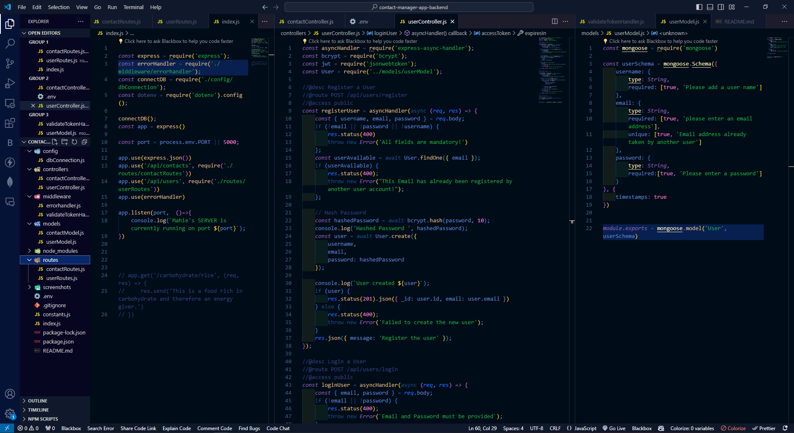

# README

-   This has been a significant project that has helped to immensely improve  my knowledge and skill in Node.JS, ExpressJS and MongoDB. I am very grateful.

## Screenshot

The above links to an image of my vscode screen after completing the project.

## Steps Followed through in this project
-   I started with the *express project Setup*
-   Created an *express server*
-   Installed and setup the *thunder client* to test *APIs*
-   Setup of the *express router*
-   Worked on the *Error Handling* for the *express* project and using the *Async Handler*
-   Setup the *Express Middleware* for the project
-   Did the *MongoDB Setup*
-   Worked on the *Mongoose Schema* to communicate with the *database*
-   *CRUD API* in our project
-   Worked on *User Authentication* and Authenticating Users.
-   Created the *Registration & Login API/Login Endponints*
-   *Controllers & DB Operations*-> Worked on the *Controllers* that will communicate with the *database* for different operations
-   *Password Hashing & Comparing*->  Worked on *password Hashing* and compared the *hashed password* with the *raw password*
-   *Sign-in/ Verify JWT Token*-> Used the *JWT Token* and so had the *sign-in and verification* of the *JWT Token* for the *authenication file*
-   *Protected Toutes*-> Worked on *protected routes* so only *authenticated users* are able to access those *routes*
-   *User Authorization*-> Worked on User authorization so that only authorized users are able to access the created endpoints
-   Tested the *API* one last time.

-   This is a follow-through project from Mr. Dipesh Malvia's Youtube Channel. The original video can be found at: [Learn Node.js & Express with Project in 2 Hours](https://youtu.be/H9M02of22z4)

-   Project completed : 21 April, 2024